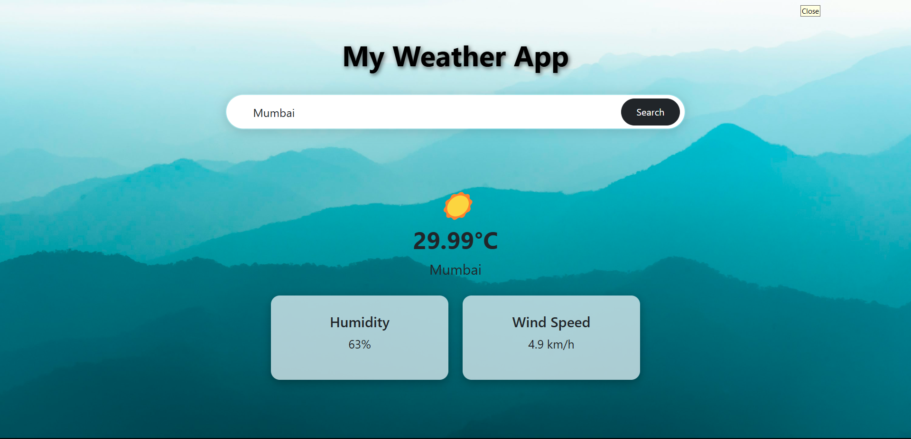

# 🌤️ Weather Website

A simple and interactive weather website that provides real-time weather information for cities around the world. Built using HTML, CSS, JavaScript, and integrated with the OpenWeatherMap API.

## 🔗 Live Demo
[Click here to view the live demo](https://vinayak180302.github.io/weather-website/)/)
## 📸 Screenshot

 <!-- Replace with your actual screenshot filename -->

## 🚀 Features

- 🌍 Get weather information for any city
- 📅 Displays current date and time
- 🌡️ Shows temperature, humidity, and weather description
- 📱 Responsive design for all screen sizes
- 🔄 Real-time API integration

## 🛠️ Technologies Used

- HTML5
- CSS3
- JavaScript (Vanilla)
- [OpenWeatherMap API](https://openweathermap.org/api)

